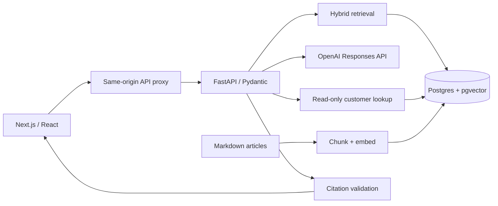

# Harbor — support with context

A support workspace that retrieves help-center evidence, checks a ticket's customer account, and prepares a reply for human review. Built with **Next.js, TypeScript, Python/FastAPI, LangChain, and PostgreSQL/pgvector**. All companies, customers, policies, and tickets are fictional.

## What works

- Responsive ticket queue with search, conversation view, editable drafts, source expansion, and an activity trace.
- Copy/download, auto-saved per-tab drafts, review, simulated sending, reopen, and reset. No real email integration or delivery.
- Fifteen original Markdown help articles, LangChain Markdown/recursive splitting, bounded parent-section retrieval, and an idempotent indexing command.
- **Sample mode:** no database or API key needed; lexical retrieval and extractive replies. Clearly labeled throughout the UI. It does not simulate semantic search, model reasoning, or token usage.
- **Live mode:** OpenAI embeddings, Postgres vector + full-text retrieval combined with reciprocal rank fusion, a server-bound read-only customer lookup, structured Responses API output, and citation-ID validation.
- Tenant predicates, strict input schemas, fixed ticket-to-customer binding, fail-closed citation handling, rate limiting, provider timeouts, and bounded output tokens.
- Unit/API tests, a disposable Postgres integration suite, browser tests, and 25 retrieval evaluation cases.

## Architecture



The Python service owns business logic and permissions. Next.js handles the interface and a small forwarding route. Model selection is server-configured. The model cannot select a tenant, change account identifiers, execute SQL, or modify customer records.

## Run the sample

### Docker: all three services

With Docker Desktop running in Linux-container mode, run from this directory:

```sh
docker compose up --build -d --wait
```

Open http://localhost:3001. This starts a production Next.js standalone server, FastAPI, and Postgres/pgvector. Port 3001 avoids the native development preview on 3000. Containers wait for dependency health checks; the API is reachable only inside the Compose network, and the published frontend/database ports bind to localhost. Database files persist in the `harbor_data` volume. Both application containers run as non-root users.

Once running, `python scripts/smoke.py` checks the frontend assets, API proxy, sample data, retrieval, and a cited draft. It refuses to run against live mode to avoid inference charges.

```sh
docker compose logs -f frontend backend
docker compose down
```

`down` stops containers without deleting the database volume. Copy the root `.env.example` to `.env` for optional port overrides or live settings. This root file supplies Compose variables; `backend/.env` is for native Python development and is deliberately excluded from images. A changed Postgres password does not change credentials already stored in an initialized volume. Use URL-safe characters in the local password because it is interpolated into a connection URL.

For live Docker mode, fill `OPENAI_API_KEY`, `OPENAI_MODEL`, and the separate `API_ACCESS_KEY` in the root `.env`, then run:

```sh
docker compose up -d db
docker compose run --build --rm backend python -m app.ingest
```

Indexing makes paid embedding requests. Once indexing succeeds, set `APP_MODE=live` in the root `.env` and run `docker compose up --build -d --wait` again. Enter the demo access key through the frontend key icon. Provider secrets are passed to the backend at runtime, never baked into either image.

### Native development

Requires Python 3.12+, Node.js 22+, and pnpm 11.19.0. From this directory:

```sh
python -m venv .venv
# Activate: source .venv/bin/activate (macOS/Linux)
# Activate: .venv\Scripts\Activate.ps1 (PowerShell)
pip install -r backend/requirements.lock
pip install --no-deps -e backend
python -m uvicorn app.main:app --host 127.0.0.1 --port 8000
```

In another terminal:

```sh
cd frontend
pnpm install --frozen-lockfile
pnpm dev
```

Open http://localhost:3000. Start with HBR-1042. Prepare a sample draft, inspect the cited article, edit the reply, and mark it reviewed. Try HBR-1045 for the no-evidence state. Review state and edits reset when the page reloads.

`frontend/.env.local.example` documents the server-only API URL. No provider secret is exposed to browser JavaScript.

## Enable real retrieval and generation

1. Start a local pgvector database with `docker compose up -d db`, or use a dedicated Supabase Postgres database with the vector extension available.
2. Copy `backend/.env.example` to `backend/.env`. Configure the database URL and OpenAI API key. Set `OPENAI_MODEL` to a model your account can access that supports Responses function calling and structured outputs. Set a separate random `API_ACCESS_KEY` of at least 24 characters. Do not reuse the provider key.
3. Run `python -m app.ingest`. **This makes paid embedding requests** and replaces this demo tenant's indexed passages inside the `harbor_*` tables. The transaction does not modify other tenants. It seeds fictional customers and tickets.
4. Set `APP_MODE=live` and restart FastAPI. Use the key icon in the frontend to enter the demo access key. It stays in page memory only.
5. Live drafts reserve a persistent allowance, make one query-embedding request, read the ticket-bound customer directly, and make at most one generation request. No automatic retry or unbounded agent loop is used.

The default embedding model is `text-embedding-3-small` with 1,536 dimensions. Index and query model identifiers must match. Changing model or dimensions requires reindexing (and a schema migration for dimension changes). The semantic-distance cutoff is an initial heuristic, not a calibrated confidence threshold.

## LangChain retrieval and context boundaries

Both sample and live requests use a request-local LangChain `BaseRetriever` and `Document` interface. Sample ranking remains lexical; live ranking remains tenant- and embedding-model-filtered PostgreSQL hybrid search. Provider calls continue through the existing SDK adapter, preserving token accounting and the server-bound customer lookup.

Ingestion uses `MarkdownHeaderTextSplitter` to identify article/H2 sections. H3 subsections stay with their parent H2 section so an Exceptions subsection is not deliberately separated from its rule. `RecursiveCharacterTextSplitter` creates search chunks up to 800 characters with a target overlap of 120. Each child retains its parent ID and full parent text in PostgreSQL. Matching children expand to their parents, duplicate parents collapse, and at most three sources are returned. The generation request and evidence panel receive the same expanded text and citation IDs.

Sections over 6,000 characters fail ingestion with a request to author self-contained H2 sections. Retrieval limits total source text plus titles to 12,000 characters, omitting whole sections that do not fit instead of truncating them. These are character limits, not model token guarantees. Rules and exceptions spanning separate H2 sections can still be missed: document authoring and retrieval evaluation remain necessary. LangChain itself does not validate relevance or prevent prompt injection.

**Existing live database upgrade:** apply `backend/schema.sql` before starting the updated live backend. It adds nullable parent columns without deleting data. Existing rows remain searchable with their original child-only content; expanded context requires running `python -m app.ingest` again (paid embeddings). That command applies the schema too and replaces only the configured demo tenant's chunks in one transaction. Keep sample mode enabled until ingestion completes. Back up any non-demo data before indexing; the bundled command is only intended for the fictional demo tenant.

No hosted LangSmith tracing is configured by this project. LangSmith is a transitive LangChain dependency; externally setting its tracing environment variables can enable export, so leave them unset when working with private content unless explicitly intended.

## Verify

```sh
python -m pytest backend/tests -q
python evals/run.py
cd frontend
pnpm typecheck
pnpm build
pnpm exec playwright install chromium
# Start the sample FastAPI service before browser tests.
pnpm test:e2e
```

Set `TEST_DATABASE_URL` to a **disposable pgvector database** to enable database integration tests. They create the `harbor_*` schema if absent and use unique test tenant IDs. CI supplies a dedicated database. Without that variable, those database tests are explicitly skipped.

`python evals/run.py` writes `eval-results.json`. It measures **retrieval**, not generated-answer accuracy. `--live` makes paid embedding requests against the live index. The paraphrase case intentionally exposes limitations of the sample lexical baseline. See [validation notes](docs/validation.md) for measured results and unverified paths.

## Deployment and limitations

The portfolio homepage remains a static GitHub Pages site. GitHub Pages cannot execute Next.js server routes or Python. Both applications have Dockerfiles; Compose runs the complete stack locally. For deployment, use a container-capable host and an appropriately secured database. The backend build context is this project directory; the frontend build context is `frontend/`. The Compose defaults are for local use, not a public ingress/TLS configuration.

This is a working portfolio vertical slice, **not a claim of production security certification**:

- Live access currently uses a single shared demo key bound to one server-configured tenant. It is not Supabase user authentication. Add verified user sessions, role mapping, and per-user authorization before accepting real users or real data.
- The burst limiter is per process. Paid attempts additionally use PostgreSQL-backed daily/monthly quotas across workers and restarts. These bound request counts, not an exact dollar bill; infrastructure charges and manual ingestion are separate.
- RLS blocks direct anonymous table access; the server connection uses explicit tenant predicates. Do not expose an owner/service credential in the browser or reuse a production database.
- Citation checks validate IDs, not semantic entailment. A valid citation can still accompany a wrong claim. Human review and a separately scored live answer evaluation are required.
- Sample mode copies passages and cannot decide refund eligibility or interpret arbitrary requests. It is an interface and retrieval baseline, not a fallback quietly substituted for live AI.
- Drafts, edits, reviews, and simulated sends persist in browser session storage for the current tab, separated by sample/live mode. They are not server records or cross-device history. No tickets are sent or resolved in external systems.
- Real credentials, deployment, and live provider evaluation must be configured separately. Do not commit `.env` files.

## Design decisions

- LangChain Core provides the retriever/Document interface and LangChain Text Splitters handles ingestion. The scoped hybrid SQL remains explicit. No LangGraph or autonomous agent loop is needed for this bounded workflow.
- Postgres for records and vectors: one data boundary and one deployment, with exact vector search appropriate to the small corpus.
- A shadcn-style, source-owned Radix/CVA button and Tailwind, with custom workspace styling; no dependency on a hosted UI service.
- Provider SDK behind a small adapter; an Anthropic adapter can be added without moving business logic into the frontend. Only OpenAI is implemented in this version.

References: [Responses function calling](https://developers.openai.com/api/docs/guides/function-calling), [structured output](https://developers.openai.com/api/docs/guides/structured-outputs), [embeddings](https://developers.openai.com/api/docs/guides/embeddings), [pgvector](https://github.com/pgvector/pgvector).

## Invite-only hosted demo

See [the deployment runbook](docs/deployment.md). The root Dockerfile serves the exported Next.js UI and FastAPI together on one Railway service; the portfolio homepage can link to it. This avoids a second Node.js hosting service. Existing Docker Compose and native development still work.

Visitors start in public sample mode. Entering Scott's demo key unlocks the live routes; the key stays in page memory, not local storage or a URL. Returning to sample mode or refreshing removes live access from the active session. Mode changes restore separate saved progress for each mode. The demo key is never saved with that progress. Public sample requests explicitly select fictional bundled data and cannot invoke the paid provider. The backend verifies every live request independently of the UI.

A shared invite key is a bearer credential, not individual user authentication. A recipient can share it; rotate API_ACCESS_KEY and restart to revoke all copies. Defaults allow 20 paid attempts/day and 200/month per tenant, globally, measured in UTC. Reservations are serialized transactionally before embeddings or generation. Failed/aborted attempts still consume allowance; retries require a new reservation. Set either limit to zero to stop paid drafts. Ingestion does not reset allowances. Do not place the key in the repository, static build, frontend environment, or URL.


## Complete demo workflow

Use the visible **Demo access** button to enter the Harbor `API_ACCESS_KEY` (not the provider's `OPENAI_API_KEY`). Without it, the entire workflow runs in sample mode with no model charges.

1. Choose a fictional ticket and prepare a draft.
2. Inspect the cited passages and activity; edit the reply. Edits auto-save in this tab.
3. Mark the final wording reviewed. Editing it again removes review approval.
4. Select **Simulate send**. This records the reply locally, locks it for editing, and places the ticket in **Sent (demo)**. It does not call an email service. Escalated drafts cannot be sent.
5. Reopen the ticket to revise it, or use **Reset demo** and confirm to clear this mode's work. Resetting does not reset paid usage allowances.

A reload retains fictional work but removes the live credential. Re-enter the demo key to restore live work. Browser storage failure is surfaced; no server persistence is implied.

## Free repository checks

`Harbor checks` runs API tests against disposable PostgreSQL/pgvector, a deterministic retrieval gate, Python lint, TypeScript checking, the actual deployment Docker build, container smoke checks, and desktop/mobile Playwright journeys. Reports and failure traces are uploaded for 14 days. No OpenAI or Supabase credentials are required in CI.

`Harbor security` adds CodeQL for Python and TypeScript, Gitleaks, and Python/frontend dependency audits. Dependabot proposes weekly dependency, container-base, and Actions updates. These files only activate after they are pushed; a green local test run is not a GitHub status check. Configure required checks on the default branch after the first successful run.

Retrieval CI requires recall@3 >= 0.95 and perfect no-result accuracy on the small bundled test set. The lexical sample currently misses one paraphrase. This is not a model answer-quality score.

For opt-in paid regression probes, run `python evals/answers.py --live` from this project directory. It covers two supported tickets, an unknown topic, and a refund prompt-injection probe, using the persistent demo allowance. Inspect `answer-eval-results.json` manually; passing four probes does not establish general factual accuracy or injection resistance.
